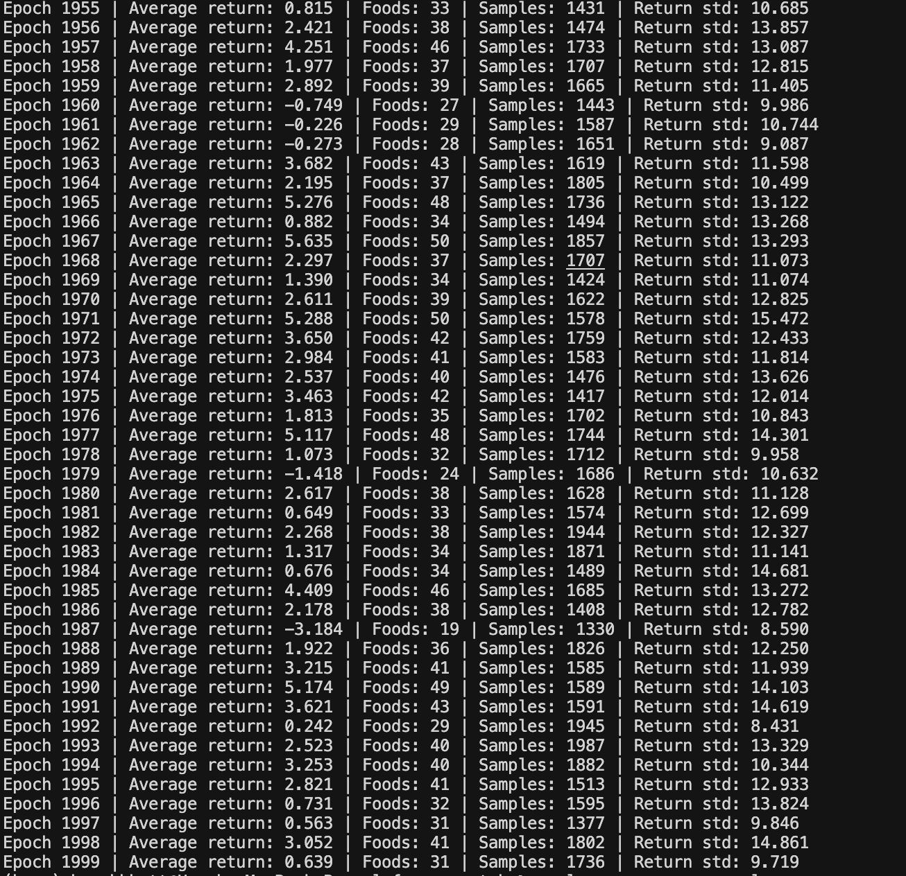

# cRL

cRL is a simple RL library implemented in C. It comes with an autograd engine to handle gradient computation for neural networks and a small RL framework to build and train agents. This repo trains an agent to play the Snake Game ENV using a simple neural network with REINFORCE loss.

Built from scratch --

- Autograd engine
- REINFORCE loss
- Matrix multiplication
- Softmax and ReLU
- Linear layers, weights, and biases
- RL replay buffer and trajectories

## Quickstart - Train agent to play snake game

Build the project from the repo root:

```sh
clang env.c -o env -lm
```

Run the training:

```sh
./env
```

## Training of SnakeENV


